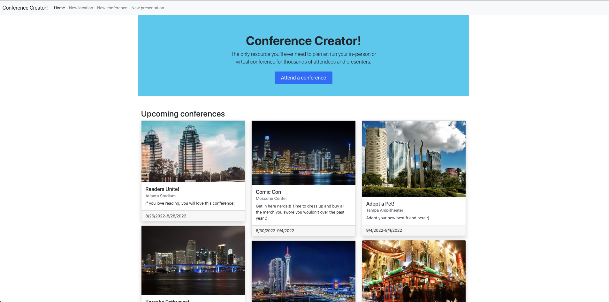

- Conference Creator

- App Overview
  Conference Creator is an application used that may be used by an organization to plan and run either an in-person or virtual conference for thousands of attendees and presenters. Within Conference Creator, you can create a new conference, create new presentations for the presenters within each conference, allow for attendees to declare if they will be attending a specific conference, and create a new location for conferences. This application also utilizes RabbitMQ and mailhog to send an email to a presenter whether their presentation has been approved or rejected once they have submitted their presentation form.
  Overall, Conference Creator utilizes third-party API's, one which pulls photos for the conference location and one that grabs weather data based on longitude and latitude coordinates. The application originated as a monolith and was later converted into 7 dockerized containers and 3 microservices to improve horizontal scalability and balance server load.

- App Technologies

* Django
* React
* Docker
* RabbitMQ (Pub/sub & Queueing)
* Mailhog
* RESTful API's
* Third-Party API Integrations (Pexels API, Weather API)

- Directions for running the application

* Fork and clone
* In terminal run docker compose build
* Once Conference Creator has built, run docker compose up
* Explore!
